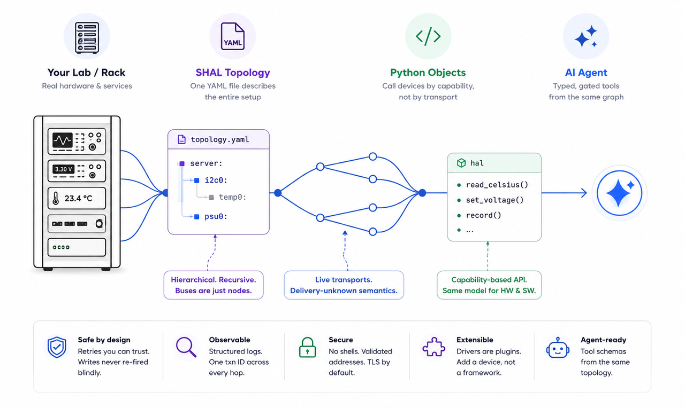
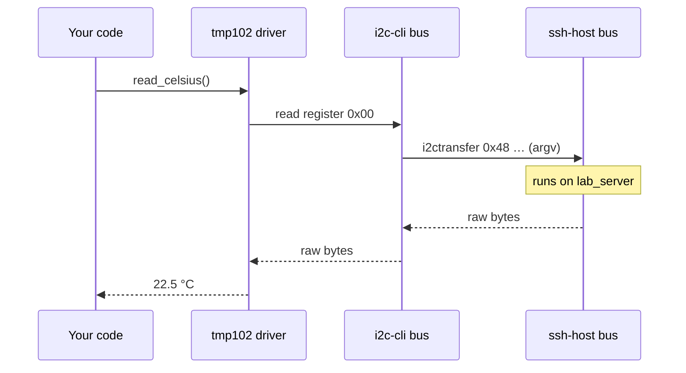

<div align="center">

# SHAL

### Turn your whole lab — hardware *and* software — into safe tools for an AI agent.

Describe any setup — sensors, instruments, robots, services — in **one YAML file**.
Control it from Python, or hand it to an LLM as **typed, permission-gated tools**.
No transport code. No glue.

<!-- BADGES -->
[](https://github.com/determlab/shal)
[](#install)
[](#install)
[](LICENSE)
[](#roadmap)

<picture>
  <source srcset="docs/assets/SHAL_banner.webp" type="image/webp">
  
</picture>


### [→ Try it in 60 seconds — no hardware required](#quick-start)

</div>

**Built for:**

✓ AI agent builders &nbsp;·&nbsp; ✓ Validation & test engineers &nbsp;·&nbsp;
✓ Hardware-in-the-loop automation &nbsp;·&nbsp; ✓ Labs with mixed hardware + software

---

## From glue scripts to agent tools — in three steps

**Step 1 · Today, without SHAL** — a separate library, address, and retry per device:

```python
sensor  = TMP102(i2c_bus, 0x48)
supply  = SCPIPowerSupply("10.0.0.50:5025")
results = RESTClient("https://mes.lab.internal")
# ...and you wire each one's retries, logging, and tool-wrapper by hand
```

**Step 2 · With SHAL** — describe the rack once, then call devices by name:

```python
hal = shal.load("lab.yaml")

hal.get_device("ambient_temp").read_celsius()       # I²C sensor
hal.get_device("dut_power").set_voltage(3.3)        # SCPI supply
hal.get_device("results_db").record(status="pass")  # HTTP service
```

> **Validation & test engineers can stop here.** One model for the whole rack —
> no agent needed, no transport code, no glue.

**Step 3 · Hand the same rack to an agent** — the tool catalog is generated for you:

```python
tools = hal.tool_schemas()                           # one typed tool per device op
hal.call_tool("dut_power__set_voltage", {"volts": 3.3})
```

> Writes are gated, reads aren't. The agent never sees SCPI, I²C, or an address.

---

## Why existing agent frameworks fall short

Most agent tooling assumes **software-only** tools: APIs, databases, functions.
The moment a tool is a *physical* device — a sensor on I²C, an instrument over a
raw socket, a robot behind a network hop — you're on your own.

SHAL exposes physical devices, remote labs, instruments, **and** software
services as the *same* kind of tool — with the safety rails physical actions
need: gated writes, honest failure, a full audit trail.

---

## One model for hardware *and* software

The core idea is small:

> **A bus is just a node that provides a transport to its children.**

A sensor on I²C and an HTTP service are the same kind of node. Your code — and
your agent — calls **capabilities** (`read_celsius()`, `set_voltage()`), never
transports. `[core]` ships with SHAL; `[pkg]` is a driver you install or write.

```yaml
# lab.yaml — hardware and software in ONE graph
shal_version: 1
root:
  bench:                         # one SSH hop to the bench controller       [core]
    driver: shal,ssh-host
    address: ${BENCH_SSH}        # secrets resolve from the environment, never logged
    children:
      i2c0:                      # I²C rendered as argv over the SSH hop      [core]
        driver: shal,i2c-cli
        address: /dev/i2c-1
        children:
          ambient: { id: ambient_temp, driver: ti,tmp102, address: 0x48 }   # [core]

  instruments:                   # raw-socket SCPI bus                        [pkg]
    driver: acme,scpi
    address: 10.0.0.50:5025
    children:
      supply: { id: dut_power, driver: keysight,e36312, address: ch1 }       # [pkg]

  services:                      # HTTPS to internal services                [core]
    driver: shal,http
    address: https://mes.lab.internal
    children:
      results: { id: results_db, driver: acme,mes-results, address: api/v2 } # [pkg]
```

Every node is reached the same way — `hal.get_device("dut_power").set_voltage(3.3)`
— sensor or database, local or across the network. Same retries, same logs. Swap
any node for its sim and **nothing in your code changes**.

---

## Features

- **Agent-native** — every device op becomes a gated LLM tool.
- **Asks before it moves** — actuator & destructive/config ops stop for a
  host-supplied approver (CLI prompt, an agent, or auto in sim/CI); the gate is
  pre-I/O and unbypassable.
- **Hardware + software, one graph** — a sensor and an HTTP service are the same node.
- **Capabilities, not wires** — call `read_celsius()`, never I²C.
- **Retry you can trust** — reads auto-retry; risky writes never silently repeat.
- **Sim-first** — test the whole rack with zero hardware.
- **Recursive** — muxes, jumpboxes, nested buses: one primitive, no special cases.
- **Drivers as plugins** — add a device in one small class.
- **Secure by default** — no shell strings, TLS on, secrets via `${ENV}`.
- **Observable** — structured logs, one `txn` id per call.

---

## Install

> SHAL is in **alpha** (Phase 1). A PyPI release is coming; for now install from
> source:

```bash
pip install git+https://github.com/determlab/shal

# or, for development
git clone https://github.com/determlab/shal && cd shal
pip install -e ".[dev]"                                  # pytest, ruff
```

Requires **Python ≥ 3.10**. Dependencies: `pyyaml`, `jsonschema`.

---

## Quick Start

Runs with **zero hardware** — the simulated bus ships with SHAL. New to hardware?
This is the whole setup, and it's just Python and a YAML file.

```yaml
# sim.yaml
shal_version: 1
root:
  bus:
    driver: shal,sim-i2c
    address: sim0
    children:
      temp0:
        id: ambient_temp
        driver: ti,tmp102
        address: 0x48
```

```python
import shal

with shal.load("sim.yaml") as hal:
    print(hal.get_device("ambient_temp").read_celsius())   # 25.0
```

```bash
$ python quickstart.py
25.0
```

When the real board arrives, change `shal,sim-i2c` → `shal,i2c-cli`. **Your
Python doesn't change.**

---

## Write a driver in 30 seconds

Need a device SHAL doesn't have yet? A driver is one small class. This is the
*entire* bundled temperature-sensor driver:

```python
from shal import Driver, TemperatureSensor, registry, idempotent, op, ByteTransport, Read, Write

@registry.register
class Tmp102(Driver, TemperatureSensor):
    compatible = "ti,tmp102"          # matched against the YAML `driver:` field
    kind = ByteTransport
    llm_ready = True

    @idempotent                        # a read: safe to auto-retry across drops
    @op("Read the ambient temperature now.", unit="celsius", side_effect="none")
    def read_celsius(self) -> float:
        raw = self.bus.txn(self.addr, [Write(b"\x00"), Read(2)])
        return ((raw[0] << 4) | (raw[1] >> 4)) * 0.0625
```

That's it — register the `compatible`, implement the capability. The `@op`
metadata is what makes it show up as a gated agent tool. SHAL discovers your
driver via the `shal.drivers` entry point.

---

## How It Works

A topology is a tree, and **every edge is a bus** — itself a node that carries
traffic to its children. You call a capability; SHAL translates it down the stack
to the wire and hands the result back up. No layer leaks into the one above.



Because every hop is the same primitive, an SSH jumpbox, an I²C mux, and an
in-process sim all compose — no special cases.

---

## Core Concepts

| Concept | What it means |
|---|---|
| **Node** | Anything in the tree: a device, a bus, a board. |
| **Bus** | A node that provides a transport to its children (I²C, SSH, HTTP…). |
| **Driver** | Bound to a node by its `compatible` string. Implements a capability. |
| **Capability** | The typed API your code calls (`read_celsius()`), independent of transport. |
| **id vs path** | `id` is a stable name for lookup; `path` is where it sits. Move a device, keep its `id`. |

```python
hal.get_device("ambient_temp").read_celsius()   # by semantic id — no wires leak in
```

---

## Real-World Use Cases

- **AI agents with real-world access** — expose a lab or robot to an LLM as
  gated tools; every actuator call stops for a human (or policy) to approve
  before it fires, and a delivery-unknown write is never silently retried.
- **Validation & test racks** — one model for eval boards, instruments, and the
  results database; test against sims in CI before hardware.
- **Manufacturing lines** — same capability calls across stations; one audit
  trail (`shal.audit`) for every actuator command.
- **Remote & distributed setups** — drive hardware behind an SSH jumpbox with
  nothing on the far side but standard CLI tools.
- **Robotics bringup** — start against a sim, swap in transports as boards land,
  without rewriting control code.

---

## FAQ

**Why not just wrap Python libraries as agent tools myself?**
You can — until there are ten devices on four transports, some behind an SSH hop,
some not. Then you're hand-maintaining a tool wrapper, address, retry policy, and
audit log *per device*. SHAL generates all of it from one topology.

**Is it production-ready?**
It's **alpha** (Phase 1). The synchronous core — topology, drivers, buses, retry
policy, and the agent tool surface — is real and tested. Async/streaming, the
actuator watchdog, and route failover are Phase 2 ([roadmap](#roadmap)).

**Do I need real hardware to try it?**
No. The bundled simulated bus runs the [Quick Start](#quick-start) with zero
hardware — swap in a real transport later, and your code doesn't change.

---

## Roadmap

**Shipped — Phase 1 (synchronous core, v0.1.0):**

- ✅ Declarative YAML topology: JSON-Schema validation, `id`/`path`/`$ref`,
  `${ENV}` secrets, reusable `template:` includes
- ✅ Bundled buses: `sim-i2c`, `local`, `ssh-host`, `i2c-cli`, `spi-cli`,
  `tcp` (TLS), `http`, `nxp,pca9548` mux
- ✅ Capability model, driver plugin registry, trustworthy retry policy
- ✅ Agent tool surface: `tool_schemas()` / `tool_catalog()` / `call_tool()`
- ✅ Human-in-the-loop actuation gate: actuator ops stop for an injectable
  `Approver` (pre-I/O, unbypassable, every decision audited)
- ✅ Structured observability + `capture()` flight recorder

**Designed, in progress — Phase 2:**

- 🚧 Async / streaming (`subscribe`, held channels) — [spec](docs/DESIGN%20-%20PHASE%202%20ASYNC.md)
- 🚧 Actuator watchdog & safe-state (timeouts, auto safe-state on disconnect)
- 🚧 Route failover for multi-path devices

---

## Documentation

- [Architecture & locked decisions](docs/DESIGN%20V2.md)
- [Phase 1 implementation decisions](docs/DECISIONS%20-%20V2.1.md)
- [Phase 2 async + watchdog spec](docs/DESIGN%20-%20PHASE%202%20ASYNC.md)
- Build guides: write a [driver](.claude/skills/shal-build-driver/SKILL.md),
  a [bus](.claude/skills/shal-build-bus/SKILL.md), or a
  [topology](.claude/skills/shal-build-yaml/SKILL.md)

---

## Contributing

Contributions welcome — **new drivers and buses especially**. A driver is one
small class (see [above](#write-a-driver-in-30-seconds)); SHAL discovers it via
the `shal.drivers` entry point.

```bash
pip install -e ".[dev]"
python -m pytest          # test suite
ruff check src tests      # lint
```

See [CONTRIBUTING.md](CONTRIBUTING.md) for the full guide.

---

## License

[MIT](LICENSE).
