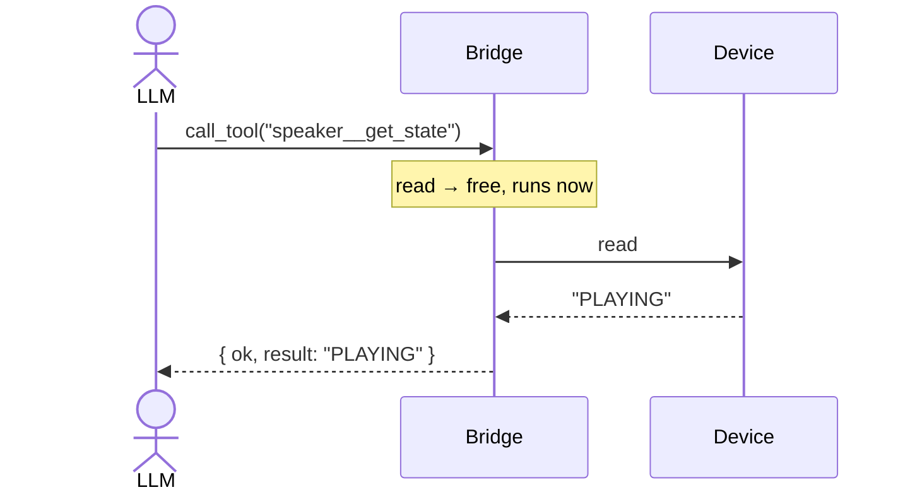
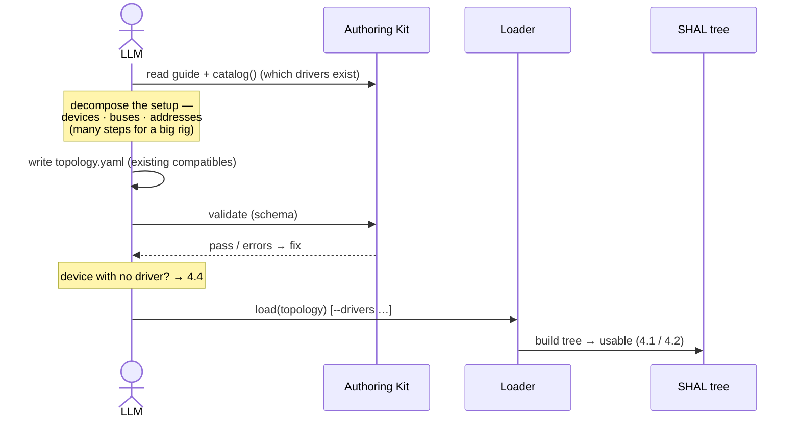
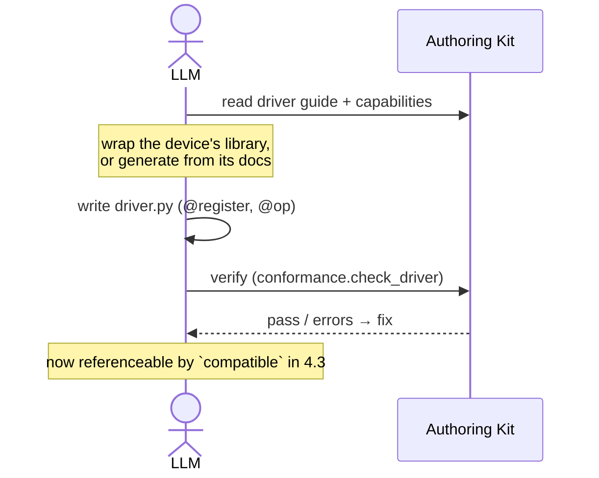

# SHAL — Architecture (north star)

> **Living doc. High-level only** — details live in `docs/design/`. Every non-trivial
> PR must be consistent with this, **or amend the Decision Ledger** at the bottom.
> If a change fights this doc, we change the doc on purpose — we don't drift silently.

---

## 1. Principles

- **Device-agnostic core.** The package ships the *framework*, not devices.
- **One self-contained core.** The HAL + Bridge is the single source of truth, usable
  directly from Python; the `shal` CLI, MCP, and skills are thin adapters over it.
- **Self-sufficient from the package.** Everything a *general* AI agent needs to turn a
  user's setup into a working topology + drivers ships **in-package, provider-neutral**
  (not Claude-specific). *(A target we bind to — not yet true.)*
- **The gate is unbypassable.** Anything that changes hardware stops for a human.
- **YAML is pure data.** A topology never executes code.

---

## 2. Components

The package gives an agent **two faces:**

```
              ┌─ Run    → SHAL tree + Gate → Bridge → adapters: shal CLI, MCP
   Agent ─────┤
              └─ Author → Authoring Kit            → adapters: skills, …
                         (in-package: guide · catalog · schema · verify; examples linked)
```

**A — Run** (use a device that exists):
Topology (YAML) → Loader + Registry → **SHAL tree** + **Gate** → **Bridge** → adapters.

**B — Author** (add a device that doesn't exist yet):
the **Authoring Kit** (in-package, provider-neutral) → adapters.

| Component | What it is |
|---|---|
| **Topology (YAML)** | the user's setup; **pure data** |
| **Loader + Registry** | resolve drivers by `compatible`, build the tree |
| **Drivers / Buses** | device support (*content*): a driver bound by `compatible`; buses are transport hops (muxes select *inside* the hop) |
| **Capabilities** | *optional* contracts for substitutability (Protocols) — a driver works without one |
| **SHAL tree** | the loaded **S**oftware/**H**ardware system: `get_device`, `call_tool`, `tool_schemas` |
| **Gate** | **one gate**, enforced at the **op-wrapper** layer (on `@op side_effect`), every call path; the **Bridge renders** it as the ticket flow. Reads free, writes gated |
| **Bridge** | the agent-facing **gated tool surface** — the runtime core, **MCP-independent** |
| **Authoring Kit** | the in-package, provider-neutral **author → verify → use** knowledge + tools (guide · `catalog()` · schema · `conformance`). Examples are **repo-linked**, not bundled |
| **Adapters** (thin) | `shal` CLI + MCP (over the Bridge) · skills (over the Kit) |

**One line:** Topology + registered drivers → Loader builds the **SHAL tree** → **Bridge**
wraps it as a gated tool surface → **adapters** expose it. The **Authoring Kit** is how an
agent produces the drivers + topology in the first place.

---

## 3. Interfaces (two contracts)

Both are thin views over the same core (the Bridge / API). The CLI is itself an adapter.

### User / operator — a human at a terminal
- **Topology YAML** — describe the setup (pure data).
- **`shal` CLI** *(the base front door — D11; today these still live under `shal-mcp`)*:

  | verb | does | today |
  |---|---|---|
  | `probe [tool]` | one-shot read → print + exit | ✅ `shal-mcp --probe` |
  | `call <tool> [args]` | call a tool → result **or** a ticket | proposed |
  | `approve` / `deny <id>` | resolve a gated ticket | MCP tools today |
  | `tools` / `catalog` | list the surface | API today |
  | `--drivers <path>` | load local drivers | ✅ |
  | `serve` | run as an MCP server | ✅ `shal-mcp` |

### Agent / API — an LLM driving SHAL in-process (no MCP needed)
- **Run:** `shal.load(topology)` → tree · `tool_schemas()` / `tool_catalog()` (discover) ·
  `call_tool(name, args)` (→ result or `approval_required`) · `approver(...)` (gate policy) ·
  `Bridge(hal)` (the gated surface + approve/deny).
- **Author:** `@shal.register`, `Driver`, `@op`, `@idempotent` (write) · `conformance.check_driver`,
  `catalog()`, the JSON schema (verify) — i.e. the **Authoring Kit**.

---

## 4. Key flows  *(the LLM agent is an actor in each)*

### 4.1 Read — free, immediate


### 4.2 Gated write — the trust moment
```mermaid
sequenceDiagram
    actor LLM
    participant Bridge
    actor Human
    participant Device
    LLM->>Bridge: call_tool("arm__move", {dx:5})
    Note over Bridge: op gated (side_effect) → Bridge renders the gate:<br/>nothing sent; store (op,args), mint ticket
    Bridge-->>LLM: approval_required (id)
    LLM->>Human: approve arm__move(dx=5)?
    alt Human approves
        Human->>Bridge: shal_approve(id)
        Bridge->>Device: execute stored (op,args)
        Device-->>Bridge: result
        Bridge-->>LLM: { ok, result, approved }
    else Human denies
        Human->>Bridge: shal_deny(id)
        Note over Bridge: ticket discarded;<br/>nothing ever sent
        Bridge-->>LLM: { denied }
    end
```

### 4.3 Author a topology — the usual path (use existing drivers)


### 4.4 Author a driver — only when a device isn't supported


> **Parallelism:** a driver is a self-contained, self-registering unit with no
> dependency on the others — so *N* missing drivers fan out to *N* agents, each authored
> and verified independently. (A shared bus / capability is authored once.)

---

## 5. Decision Ledger  *(locked — append, don't silently re-litigate)*

| # | Decision | Source |
|---|---|---|
| D1 | **Device-agnostic core:** device **drivers** + **examples** aren't bundled (repo / community). Capability **contracts** and the Authoring Kit *do* ship (governed content — D8/D13). The line: **contracts ship, drivers don't** | #46 |
| D2 | **One self-contained core; non-MCP is primary.** The `shal` CLI, MCP, and skills are thin adapters over it | reframe |
| D3 | **Two faces to an agent:** *Run* (Bridge) and *Author* (Authoring Kit) | this doc |
| D4 | **One gate**, enforced at the **op-wrapper layer** (on `@op side_effect`), every call path — independent of whether a Capability is declared. The **Bridge renders** it as the ticket flow (not a second gate). Transport (mux select) rides *inside* the op | core |
| D5 | **YAML is pure data;** code is imported only via operator-controlled `--drivers` | #47 |
| D6 | Reads are free + **human-runnable** (`probe`); writes are **gated** (ticket → approve/deny) | #36 / #39 |
| D7 | Agent guidance + the **Authoring Kit ship in-package, provider-neutral** (examples stay repo-linked) | this doc |
| D8 | **Capabilities:** the *mechanism* is framework; *contracts* are a governed standards set (semver, curated) — **optional** (just `@op` works) and **user-definable** | this doc |
| D9 | **Agents reach SHAL two ways:** the Python API (direct, in-process) + the `shal` CLI (the *primary adapter*, for shell agents) | this doc |
| D10 | Drivers are **isolated, self-registering** units → authoring *N* drivers parallelizes | this doc |
| D11 | **Front door = `shal` CLI** (`probe`/`call`/`tools`/`mcp`); `shal mcp` is the MCP adapter; `shal-mcp` kept as an alias. *(Gated-write over a stateless CLI needs persistent tickets — later.)* | O1 |
| D12 | **Read freshness is a contract:** a read returns a value only if the device answered — else it **raises** (`HopError`, no silent default). SDK + `conformance` enforce it; the framework can't police library-wrapping drivers | O2 |
| D13 | **Standard capabilities live in-core** as a governed, namespaced `shal.standards` registry (discoverable); extractable to a companion package later once the set stabilizes | O3 |
| D14 | **Keep the code class `Hal`** (avoids shadowing the `shal` module); "SHAL tree" is a doc-level concept only | O4 |
| D15 | **Keep async / non-blocking open** (planned evolution). The seam is the **bus contract** (`txn` / `exchange`) — grow it to *submit-then-await + response correlation* ("held channels"); don't bake blocking-only assumptions *below* that contract. Real concurrency only on multiplexable transports | this doc |

### Open decisions
*None — all resolved. New decisions get a `D##` row above (with their source); they don't get re-litigated silently.*
