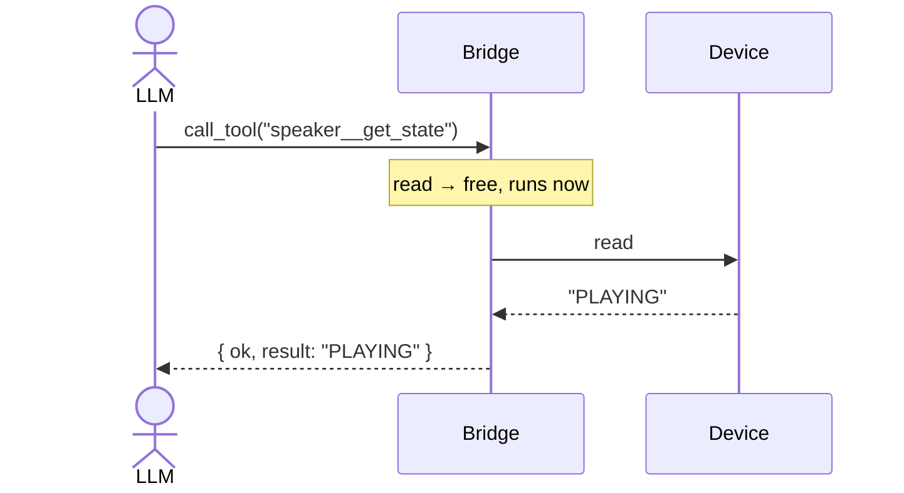
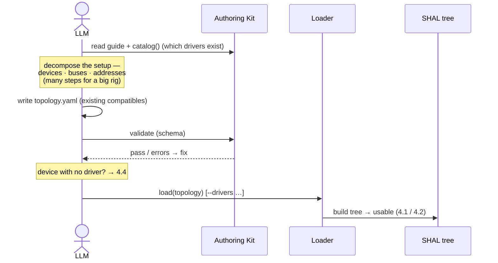
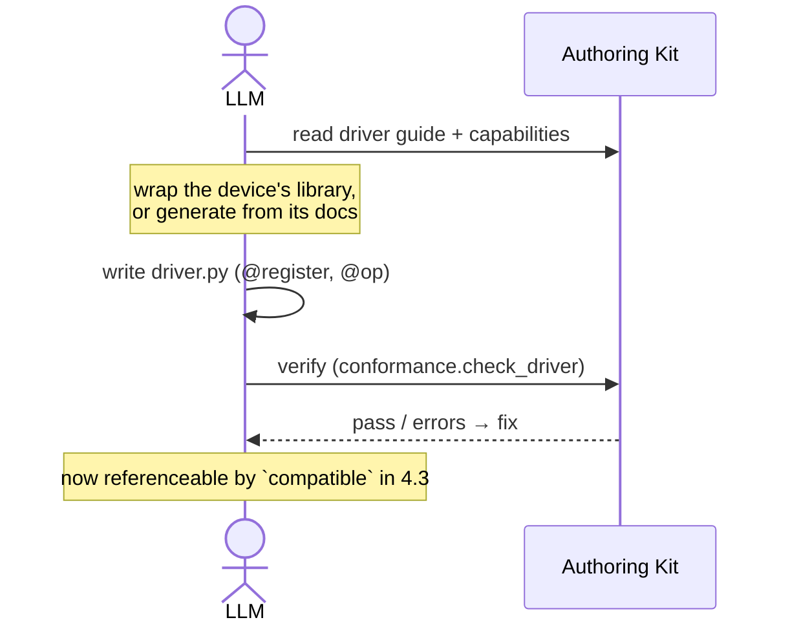

# SHAL — Architecture (north star)

> **Living doc. High-level only** — details live in `docs/design/`. Every non-trivial
> PR must be consistent with this, **or amend the Decision Ledger** at the bottom.
> If a change fights this doc, we change the doc on purpose — we don't drift silently.

---

## 1. Principles

- **Device-agnostic core.** The package ships the *framework*, not devices.
- **One self-contained core.** The HAL + Bridge is the single source of truth, usable
  directly from Python; the `shal` CLI, MCP, and skills are thin adapters over it.
- **Self-sufficient from the package.** Everything a *general* AI agent needs to turn a
  user's setup into a working topology + drivers ships **in-package, provider-neutral**
  (not Claude-specific). *(A target we bind to — not yet true.)*
- **The gate is unbypassable.** Anything that changes hardware stops for a human.
- **YAML is pure data.** A topology never executes code.

---

## 2. Components

The package gives an agent **two faces:**

```
              ┌─ Run    → SHAL tree + Gate → Bridge → adapters: shal CLI, MCP
   Agent ─────┤
              └─ Author → Authoring Kit            → adapters: skills, …
                         (in-package: guide · catalog · schema · verify; examples linked)
```

**A — Run** (use a device that exists):
Topology (YAML) → Loader + Registry → **SHAL tree** + **Gate** → **Bridge** → adapters.

**B — Author** (add a device that doesn't exist yet):
the **Authoring Kit** (in-package, provider-neutral) → adapters.

| Component | What it is |
|---|---|
| **Topology (YAML)** | the user's setup; **pure data** |
| **Loader + Registry** | resolve drivers by `compatible`, build the tree |
| **Drivers / Buses** | device support (*content*): a driver bound by `compatible`; buses are transport hops (muxes select *inside* the hop) |
| **Capabilities** | *optional* contracts for substitutability (Protocols) — a driver works without one |
| **SHAL tree** | the loaded **S**oftware/**H**ardware system: `get_device`, `call_tool`, `tool_schemas` |
| **Gate** | **one gate**, enforced at the **op-wrapper** layer (on `@op side_effect`), every call path; the **Bridge renders** it as the ticket flow. Reads free, writes gated |
| **Bridge** | the agent-facing **gated tool surface** — the runtime core, **MCP-independent** |
| **Authoring Kit** | the in-package, provider-neutral **author → verify → use** knowledge + tools (guide · `catalog()` · schema · `conformance`). Examples are **repo-linked**, not bundled |
| **Adapters** (thin) | `shal` CLI + MCP (over the Bridge) · skills (over the Kit) |

**One line:** Topology + registered drivers → Loader builds the **SHAL tree** → **Bridge**
wraps it as a gated tool surface → **adapters** expose it. The **Authoring Kit** is how an
agent produces the drivers + topology in the first place.

---

## 3. Interfaces (two contracts)

Both are thin views over the same core (the Bridge / API). The CLI is itself an adapter.

### User / operator — a human at a terminal
- **Topology YAML** — describe the setup (pure data).
- **`shal` CLI** *(the base front door — D11; shipped in #54. `shal-mcp` is kept only as an alias of `shal mcp`)*:

  | verb | does | status |
  |---|---|---|
  | `probe [tool]` | one-shot read → print + exit | ✅ `shal probe` |
  | `tools` / `catalog` | list the surface | ✅ `shal tools` |
  | `mcp` | run as an MCP server | ✅ `shal mcp` |
  | `routes <node>` | print a node's declared routes, in order (pin one: `call --via`) | ✅ `shal routes` (#237) |
  | `docs [--sdk]` | print the bundled guide / full SDK | ✅ `shal docs` |
  | `--drivers <path>` | load local drivers | ✅ |
  | `call <tool> [args]` | call a tool → result **or** a ticket | proposed (gated-write over a stateless CLI needs persistent tickets, #56) |
  | `approve` / `deny <id>` | resolve a gated ticket | via MCP tools (`shal_approve`/`shal_deny`) |

### Agent / API — an LLM driving SHAL in-process (no MCP needed)
- **Run:** `shal.load(topology)` → tree · `tool_schemas()` / `tool_catalog()` (discover) ·
  `call_tool(name, args)` (→ result or `approval_required`) · `approver(...)` (gate policy) ·
  `Bridge(hal)` (the gated surface + approve/deny).
- **Author:** `@shal.register`, `Driver`, `@op`, `@idempotent` (write) · `conformance.check_driver`,
  `catalog()`, the JSON schema (verify) — i.e. the **Authoring Kit**.

---

## 4. Key flows  *(the LLM agent is an actor in each)*

### 4.1 Read — free, immediate

```mermaid
sequenceDiagram
    actor LLM
    participant Bridge
    participant Device
    LLM->>Bridge: call_tool("speaker__get_state")
    Note over Bridge: read → free, runs now
    Bridge->>Device: read
    Device-->>Bridge: "PLAYING"
    Bridge-->>LLM: { ok, result: "PLAYING" }
```

### 4.2 Gated write — the trust moment
```mermaid
sequenceDiagram
    actor LLM
    participant Bridge
    actor Human
    participant Device
    LLM->>Bridge: call_tool("arm__move", {dx:5})
    Note over Bridge: op gated (side_effect) → Bridge renders the gate:<br/>nothing sent; store (op,args), mint ticket
    Bridge-->>LLM: approval_required (id)
    LLM->>Human: approve arm__move(dx=5)?
    alt Human approves
        Human->>Bridge: shal_approve(id)
        Bridge->>Device: execute stored (op,args)
        Device-->>Bridge: result
        Bridge-->>LLM: { ok, result, approved }
    else Human denies
        Human->>Bridge: shal_deny(id)
        Note over Bridge: ticket discarded;<br/>nothing ever sent
        Bridge-->>LLM: { denied }
    end
```

### 4.3 Author a topology — the usual path (use existing drivers)

```mermaid
sequenceDiagram
    actor LLM
    participant Kit as Authoring Kit
    participant Loader
    participant Tree as SHAL tree
    LLM->>Kit: read guide + catalog() (which drivers exist)
    Note over LLM: decompose the setup —<br/>devices · buses · addresses<br/>(many steps for a big rig)
    LLM->>LLM: write topology.yaml (existing compatibles)
    LLM->>Kit: validate (schema)
    Kit-->>LLM: pass / errors → fix
    Note over LLM: device with no driver? → 4.4
    LLM->>Loader: load(topology) [--drivers …]
    Loader->>Tree: build tree → usable (4.1 / 4.2)
```

### 4.4 Author a driver — only when a device isn't supported

```mermaid
sequenceDiagram
    actor LLM
    participant Kit as Authoring Kit
    LLM->>Kit: read driver guide + capabilities
    Note over LLM: wrap the device's library,<br/>or generate from its docs
    LLM->>LLM: write driver.py (@register, @op)
    LLM->>Kit: verify (conformance.check_driver)
    Kit-->>LLM: pass / errors → fix
    Note over LLM: now referenceable by `compatible` in 4.3
```

> **Parallelism:** a driver is a self-contained, self-registering unit with no
> dependency on the others — so *N* missing drivers fan out to *N* agents, each authored
> and verified independently. (A shared bus / capability is authored once.)

---

## 5. Decision Ledger  *(locked — append, don't silently re-litigate)*

> **This section is SHAL's Decision Ledger of record** under `decision-ledger-standard.md`
> v1.0, and it **stays here** — grandfathered on purpose, not pending a move to
> `docs/DECISIONS.md`. The decisions are load-bearing *because* they sit beside the
> principles, components and flows that motivate them (D4 → §2's Gate, D15 → the bus
> contract), `docs/agents/context.md` points every agent at this file as the single north star, and
> the shipped in-wheel SDK already cites it by this path (`src/shal/SDK.md` → "ARCHITECTURE
> D12"). Registered in `.agent-loop.yml` → `review.standards_sources`. Issues cite these
> by number: `## Decision — Implements **D12** (read freshness is a contract).`

| # | Decision | Source |
|---|---|---|
| D1 | **Device-agnostic core:** device **drivers** + **examples** aren't bundled (repo / community). Capability **contracts** and the Authoring Kit *do* ship (governed content — D8/D13). The line: **contracts ship, drivers don't** | #46; re-affirmed #110; made explicit by D23 |
| D2 | **One self-contained core; non-MCP is primary.** The `shal` CLI, MCP, and skills are thin adapters over it | reframe |
| D3 | **Two faces to an agent:** *Run* (Bridge) and *Author* (Authoring Kit) | this doc |
| D4 | **One gate**, enforced at the op-wrapper layer on `@op side_effect` **against the operator's gated set** (default `{actuator, config}`; widened freely, narrowed only from the operator's entry point, never changed by a driver — ADR-001 addendum 5), every call path — independent of whether a Capability is declared. The **Bridge renders** it as the ticket flow (not a second gate). Transport (mux select) rides *inside* the op | core; gated set: ADR-001 addendum 5 (ops `49601c9`), #114 |
| D5 | **YAML is pure data;** code is imported only via operator-controlled `--drivers` | #47 |
| D6 | Reads are free + **human-runnable** (`probe`); writes are **gated** (ticket → approve/deny) | #36 / #39 |
| D7 | Agent guidance + the **Authoring Kit ship in-package, provider-neutral** (examples stay repo-linked); the ADK reference set ships inside the Authoring Kit as unregistered guide material | this doc; #149 |
| D8 | **Capabilities:** the *mechanism* is framework; *contracts* are a governed standards set (semver, curated) — **optional** (just `@op` works) and **user-definable** | this doc |
| D9 | **Agents reach SHAL two ways:** the Python API (direct, in-process) + the `shal` CLI (the *primary adapter*, for shell agents) | this doc |
| D10 | Drivers are **isolated, self-registering** units → authoring *N* drivers parallelizes | this doc |
| D11 | **Front door = `shal` CLI** (`probe`/`call`/`tools`/`mcp`); `shal mcp` is the MCP adapter; `shal-mcp` kept as an alias. *(Gated-write over a stateless CLI needs persistent tickets — later.)* | O1 |
| D12 | **Read freshness is a contract:** a read returns a value only if the device answered — else it **raises** (`HopError`, no silent default). SDK + `conformance` enforce it; the framework can't police library-wrapping drivers | O2 |
| D13 | **Standard capabilities live in-core** as a governed, namespaced `shal.standards` registry (discoverable); extractable to a companion package later once the set stabilizes | O3 |
| D14 | **Keep the code class `Hal`** (avoids shadowing the `shal` module); "SHAL tree" is a doc-level concept only | O4 |
| D15 | **Keep async / non-blocking open** (planned evolution). The seam is the **bus contract** (`txn` / `exchange`) — grow it to *submit-then-await + response correlation* ("held channels"); don't bake blocking-only assumptions *below* that contract. Real concurrency only on multiplexable transports | this doc |
| D16 | **Agent-host adapters live outside the agnostic core.** Single-vendor host packs (Claude Code skills; future Cursor/Codex) live in `integrations/<host>/` (→ a `shal-integrations` repo), never in `src/shal/` or the wheel. **Open-standard** adapters (the `shal` CLI, MCP) stay in core. The neutral authoring contract (`src/shal/SDK.md` + shipped `shal docs`) is the source of truth the host packs render — the *agent* analog of D1 (contracts ship, host packs don't) | this doc |
| D17 | **Validation splits in two:** the JSON Schema (`src/shal/schema/shal-v1.schema.json`) checks **structure only**; every semantic check (id uniqueness, address grammar, driver installed, `$ref` targets, env resolution) stays in the loader and runs **after** schema validation | `DECISIONS - V2.1.md` §1 |
| D18 | **The error taxonomy is a contract:** `Error` → `LoadError` (anything wrong *before* runtime) and `HopError` (a runtime hop, carrying `path` / `hop` / `txn` / `delivered: "no" \| "unknown"`) → `HopTimeout`; `Busy` for a pinned mux channel; `Gap` is an **event, not an exception**. `delivered` is what makes D12's raise-don't-default rule and the never-auto-retry-an-unknown-write rule decidable | `DECISIONS - V2.1.md` §3 |
| D19 | **One entry-point group — `shal.drivers`** — for drivers and buses alike; bus-ness comes from the transport **kinds** a class exposes, not from a second group. At bind time the framework wraps every public capability method: it assigns a `txn` id always, and adds reconnect-once/retry-once **only** to `@idempotent` ops | `DECISIONS - V2.1.md` §4 |
| D20 | **A parent driver may expose a distinct bus per child:** `Driver.provide_child_bus(child)` → `Node.exposed_bus` is the single core hook a mux needs, which is why per-mux selection state lives on that shared object and never on the parent bus | `DECISIONS - V2.1.md` §Phase 1.1 |
| D21 | **Topologies compose by inclusion, not override:** `include:` merges sibling roots, duplicates are errors, includes stay inside the tree, and the main file's `.env` is the only one | #134 / CTO ruling |
| D22 | **One record shape for every runner:** `src/shal/record.py` is the single home for the test result — unit, station, firmware, setup + version, per-step verdict, every measurement with the limits **that were enforced** (copied in, not looked up later), an optional `abort` block, and the SHAL `calls` — **`calls=None` means "not collected"** (omitted from the YAML and the db's JSON, read back as `None`), while `calls: []` means "collected, none". `runner` is a **closed set of three, `pytest \| bricks \| script`** — not a free string, so a reader can enumerate who can have written a record; `script` is operator code that is neither runner (a person's loop, a one-off bench script): it records provenance, no plugin produces it, and it is never a station's evidence. A fourth value is a `RecordError`. It lives in shal because both runners and AOS already depend on shal and it must depend on neither. Written twice: SQLite `records.db` per station (the index) and `records/<id>.yaml` beside it (the audit copy) — **if they disagree, the YAML wins**. `verdict` is derived, never set by hand; fields are **added, never renamed or removed**, and `record_version` tells a reader what it holds. A change an older reader cannot read (a required key made optional) **bumps `record_version`** — it is **2** since optional `calls`; a reader reads every version up to its own, and refuses a newer one in one sentence that names both versions and never a key (*"this record is version N, newer than this SHAL reads (up to M) — upgrade pyshal"*). `read(store)` refuses the whole read for one newer record; **`read(store, newer="skip")` is the explicit opt-in, never the default**, and returns the readable records *and* the `(id, record_version)` list it skipped, so evidence is never silently partial | `record.md` §6 R1 / #141; `runner` — `record.md` §2 / #214; optional `calls` — #218; `record_version` 2 — `record.md` §7 / #223; `newer="skip"` — #227 |
| D23 | **What ships: the framework's own objects — every `shal,*` compatible; no `vendor,part` ever does.** D1's line drawn exactly: the framework's buses (sim included) and `shal,sim-sensor` (the twin machinery's own device, wrapping no part) ship registered; a vendor driver ships only as unregistered guide material (D7) or not at all. Enforced, not remembered: `tests/test_sim_sensor.py::test_every_catalog_id_is_a_shal_compatible` fails CI if `catalog()` lists anything else | `adk.md` §3.6 "what resolves on a bare install" + R10 (ops `3f97497`); founder on #110, 2026-09-26; #156 / #149 |
| D24 | **Side effects for software — the same four labels, one test for the line.** `none` is a read (live or raise). `write` **only if this driver can undo it with one of its own ops and it touches only this node's own data.** `config` changes what the system does next (a setting, a schema, a secret, a schedule). `actuator` acts now, outside the node, or cannot be undone (trigger, deploy, send, pay, `DROP`, `DELETE` for good). **Not sure → gated**; both gated labels stop at the one gate (D4) **under the default gated set**. A delete the driver's own op restores exactly is a `write` — and the op **proves** it: one transaction, exactly one row changed, else it rolls back and refuses with the reason (a trigger, a cascade, a row it cannot restore). The label never depends on the address. Worked example: the `sqlite,database` reference (#157) | `adk.md` §3.7 S3 (ops `3f97497`); restorable delete ruled in §3.7 (ops `c2e1a7c`), 2026-09-27; #147 (guide text) / #157; gated set: ADR-001 addendum 5 (ops `49601c9`), #114 |
| D25 | **The HTTP request envelope.** A `shal,http` message with any of `method` / `path` / `query` / `headers` / `json` is that request, and the reply is `{status, headers, json \| text}`; a plain mapping is still `POST`ed as JSON, unchanged. **Credentials live on the bus node** (`config.headers`, `${ENV}`-resolved, added by the bus) — a driver never holds a secret. **A non-2xx reply is a `HopError` naming the status, never a retry.** `shal,sim-msg` answers the same envelopes. Choosing a shape: a protocol you would hand-roll → under a bus; a client library → a root driver (`kind = None`) — so no database bus, no subprocess bus | `adk.md` §3.7 S1 + S2 (ops `3f97497`); founder, 2026-09-26 ("software drivers and software support"); #104 |
| D26 | **One decorator, one meaning.** `@idempotent` says only that a lost-delivery retry is safe (D19). The `side_effect` label alone decides the gate (D4, **under the operator's gated set**) **and the audit — and the audit follows the label, never the set: an op that is not `none` is audited even when the operator has narrowed the set so that it is not gated.** Every op that is not `none` is audited — limit rejection, approval, outcome — `@idempotent` or not; reads are not. An op with no label is `actuator` (gated, audited) even when `@idempotent`; `none` is the only way to declare a read. A gated op is approved once per call; the retry after `delivered="no"` does not ask again and the call keeps one outcome record (`attempt: 2`, the dropped `hop`, and — #348 — `retries: 1`/`dropped` on that same record and on `Hal.call_tool`'s own result). The tool description follows the label (only `none` is described as a read). `shal check` warns on any unlabelled device op, with one text. *Narrowing may remove the stop; it can never remove the trail.* | ADR-001 addendum 4 (ops `3fae587`), CTO ruling 2026-09-27; #194 (supersedes #183); audit vs. gated set: ADR-001 addendum 5 (ops `49601c9`), #114 |
| D27 | **Policy is the operator's.** The gated set and the approver are one policy: set by the operator's code (host, CLI, topology `policy:`), widened freely, narrowed only from that entry point; a driver module can never change it — the loader refuses a module that changes it at import (`LoadError`), the op wrapper restores and raises if an op changes it, and both are audited. The active set is on every approval record and in the `policy` event at load. **A Hal may carry its own approver, given at load and never after** (`shal.load(path, approver=a)`): it fills the same bind-time cell as the declared set inside `Hal.__init__`, before any node is published, and the cell is final — no method sets it after load; a cell a driver filled first fails the load (`LoadError`, audited). It is asked before the host's approver; every other Hal keeps the host's. `shal mcp` refuses a Hal that carries one (the ticket is the only approver under an MCP host), and a topology never declares one (D5). Every approval record and the `policy` event name the approver's source (`hal:<path>`, `host` or `default`). | ADR-001 addendum 5 (ops `49601c9`), CTO ruling 2026-09-27; #114; per-Hal approver: CTO re-ruling 2026-09-27 (pytest-shal spec §4, ops `cd62b96`), #217 |

### Open decisions
*Named, not yet decided. An issue that needs one of these is **not** ready for `agent:go`.
New decisions get a `D##` row above (with their source); they don't get re-litigated silently.*

- **O5 — Does the ledger govern the *published artifact*, or only the source?** Nothing in
  D1–D20 says the thing on PyPI must stay installable and startable. The 2026-08-30 audit
  found the consequence: unbounded optional deps (`mcp>=1.0`) + CI with no `schedule:`
  trigger meant a breaking SDK major landed in the published package unseen for 40 days
  (#105, #106). Settled by deciding whether "shipped and working from a clean install" is
  a locked decision with a standing check behind it, or release hygiene that lives outside
  the ledger.

### Superseded
*Keep the history. A replaced decision moves here with what replaced it and why.*

*None yet — D1–D20 are all live as of the 2026-08-30 audit; D17–D20 were lifted from the v2.1 addendum on 2026-08-31.*
